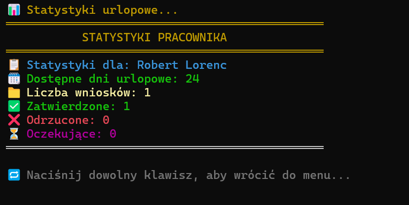

# 🗓️ TimeOffManager – Leave Management Console App


**TimeOffManager** to aplikacja konsolowa w C#, która umożliwia składanie i zarządzanie wnioskami urlopowymi.  
Projekt powstał w ramach wyzwania **„21 dni z C#”** na platformie [edu.gotoit.pl](https://edu.gotoit.pl).

## ✨ Funkcje

- ✉️ Składanie wniosków urlopowych z komentarzem i datami
- ✅ Zatwierdzanie/odrzucanie przez przełożonego
- 📊 Historia i statystyki urlopów
- 📁 Eksport danych do pliku

## 🛠️ Technologie

- C# (.NET 9)
- Programowanie obiektowe
- Obsługa zdarzeń
- Konsolowy interfejs użytkownika

## ▶️ Uruchomienie

```bash
git clone https://github.com/lor38/TimeOffManager.git
cd TimeOffManager
dotnet run
```

## 🖼️ Zrzut ekranu




## 👤 Autor

Projekt stworzony przez **Robert Lorenc**  
GitHub: [@lor38](https://github.com/lor38)

## 📄 Licencja

Ten projekt jest dostępny na licencji MIT.  
Możesz swobodnie kopiować, modyfikować i używać — z zachowaniem informacji o autorze.

## 🚧 Status projektu

Projekt w fazie rozwoju.  
Niektóre funkcje mogą być jeszcze testowane lub rozbudowywane.

## 📌 Planowane funkcje

- 🔔 Powiadomienia e-mail o zatwierdzeniu wniosku
- 🖥️ Interfejs graficzny (GUI)
- 🔐 Logowanie użytkowników
- 📆 Integracja z kalendarzem Google
